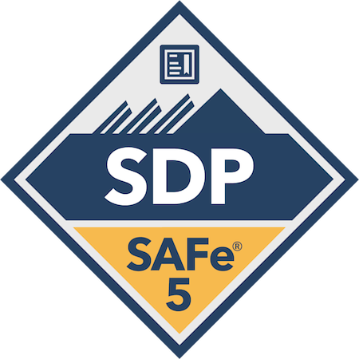

    

        <h2>Hi there 👋</h2>
        

            I'm Victor Tozzato, If asked I would probably define myself as a 
            "Problem solver" 3 of 5 times, there's this itchy feeling in my 
            brain every time I'm facing any unspecific challenge that triggers 
            my creativity department and pushes me ahead throughout a very enjoyable 
            experiment journey.
        

        

            Have being coding, modeling and inventing stuff for more than a decade 
            so far and this took me to the most unexpected places in the world, 
            quite the adventure I would say.
        

    

    

        
    

<!-- Tech Stuff -->

    
  <h3>Tech I'm currently working with or trying it out!</h3>
  

      

      

    
      

    
      

    
  

<!-- Certification & Badges -->

    <h3> Certification Badges</h3>
    

        

          
        

        

          
        
    
    

<!--
is a ✨ _special_ ✨ repository because its `README.md`
(this file) appears on your GitHub profile.

Here are some ideas to get you started:

- 🔭 I’m currently working on ...
- 🌱 I’m currently learning ...
- 👯 I’m looking to collaborate on ...
- 🤔 I’m looking for help with ...
- 💬 Ask me about ...
-  ...
- 😄 Pronouns: ...
- ⚡ Fun fact: ...
  -->

