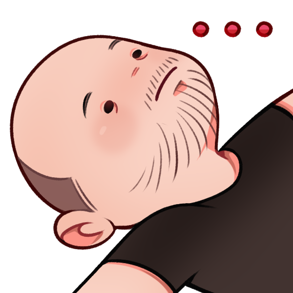
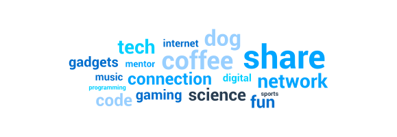
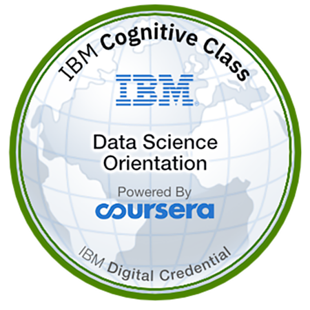
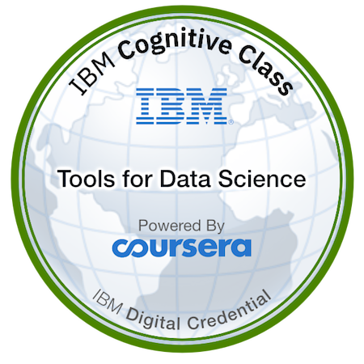

## Hi there VICTOR TOZZATTO here !!!

If asked I would probably define myself as a **Problem solver** 3 of 5 times,   
there's this itchy feeling in my brain every time I'm facing any unspecific 
challenge that triggers my creativity department and pushes me ahead throughout 
a very enjoyable experiment journey.

Have being coding, modeling and inventing stuff for more than a decade
and this took me to the most unexpected places in the world,
quite the adventure I would say.

:office: Currently working for Siemens in Lisbon   
:video_game: Pro-player in      
:book: Eager for knowledge: 

#### Tech stuff I'm currently working or testing

 
 
 

#### Certified Badges

