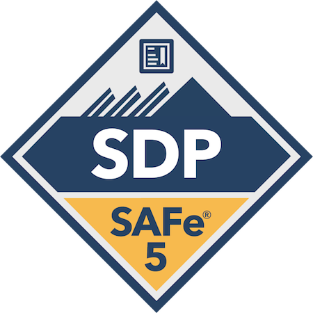

## Hi there VICTOR TOZZATTO here !!!

If asked I would probably define myself as a
**Problem solver** 3 of 5 times,   
there's this itchy feeling in my
brain every time I'm facing any unspecific challenge that triggers
my creativity department and pushes me ahead throughout a very enjoyable
experiment journey.  
  
Have being coding, modeling and inventing stuff for more than a decade
and this took me to the most unexpected places in the world,
quite the adventure I would say.

 - :office: Currently working for : Siemens in Lisbon :portugal:
 - :video_game: Pro-player in Survivals, RPG and Strategy

 

#### Tech stuff I'm currently working or testing

 
 
 

#### Certified Badges

